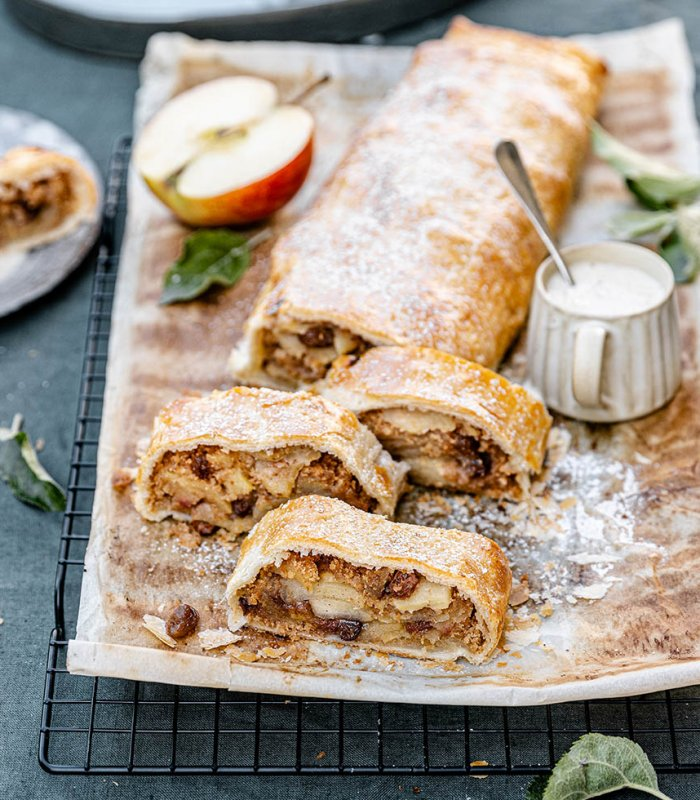

# Apfelstrudel

## Zutaten für 1 Apfelstrudel:
- 1 Pkg. Tante Fanny Frischer Blätterteig 270 g
- 450g Tante Fanny Back- und Strudelapfel geschält, in dünne Scheiben geschnitten 
- $\frac{1}{2}$ Zitrone Saft ausgepresst 
- 100g Semmelbrösel
- 50g Butter
- 50g Rum-Rosinen
- 1 TL Zimt
- 100g Zucker
- 1 Ei zum Bestreichen verquirlt 
- Etwas Staubzucker zum Bestreuen

## Zubereitung:
### Schritt 1:  
Backofen auf 200° C Ober-/Unterhitze vorheizen und Teig laut Packungsanleitung vorbereiten.

### Schritt 2:  
Apfelstücke mit Zitronensaft beträufeln. Brösel und Butter in einer Pfanne hell rösten. Apfelstücke mit Rum-Rosinen, Zimt und Zucker vermengen.

### Schritt 3:  
Blätterteig mit dem mitgerollten Backpapier am Backblech entrollen, mit Butterbröseln bestreuen und Äpfel mittig auf dem Teig verteilen.

### Schritt 4:  
Teigränder mit verquirltem Ei bestreichen und den Teig von unten zur strudeltypischen Form einschlagen. Die Seiten etwas festdrücken und den Strudel mit einer Gabel mehrmals einstechen. Nochmals mit verquirltem Ei bestreichen.

### Schritt 5:  
Im Backofen ca. 30 Min. auf unterster Schiene goldbraun backen.

### Schritt 6:  
Nach dem Backen mit Staubzucker bestreuen.

### Tipp:  
Falls du statt Blätterteig lieber Strudelteig verwenden möchtest, kannst du gleich das Rezept für unseren gezogenen Apfelstrudel ausprobieren.

## Quelle:  
<https://www.tantefanny.at/rezept/apfelstrudel-blaetterteig/> 
