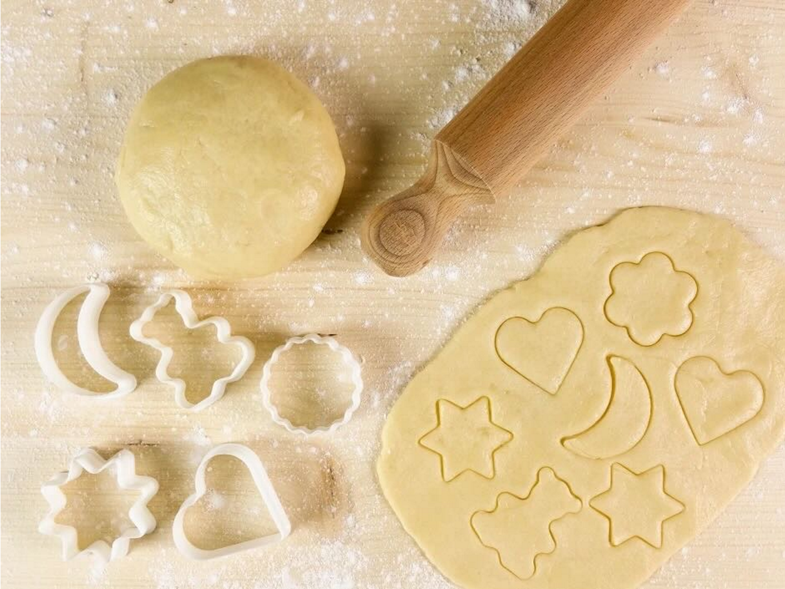

# Mürbteig

## Zutaten für 4 Portionen
- 100	g	Zucker
- 1	Pk Vanillezucker
- 200	g	Butter (kalt)
- 1	Stk	Ei
- 300	g	Mehl (gesiebt)
- 1	Prise	Salz

## Zubereitung
  1. Zucker, Vanillezucker und die in Stücke geschnittene, kalte Butter in eine Schüssel geben, ein Ei und das Mehl sowie eine Prise Salz zugeben, gut durchkneten - mit dem Mixer oder auf einer Arbeitsfläche mit den Händen.
  2. Schnell zu einem geschmeidigen Teig verkneten. Zu einem Würfel formen, in Frischhaltefolie wickeln und für mind. 30 Minuten in den Kühlschrank geben.
  3. Dann etwas Mehl auf die Arbeitsfläche geben und den Teig nochmal kurz durchkneten. Mit einem Nudelholz 0,5 cm dick ausrollen und Kekse ausstechen. Für 10-15 Min. in den vorgeheizten Backofen geben und goldbraun bei 180°, Ober- und Unterhitze backen.
  4. Nach dem Erkalten mit Staubzucker bestreuen und genießen.

## Tipps zum Rezept
Es kommen ca. 20 Stück Kekse raus.
Mit der Prise Salz kommt die Süße des Backwerks geschmacklich noch besser zur Geltung.
Es ist wichtig, dass die Butter kalt ist, sonst wird der Teig brüchig.
Um Teigklümpchen zu vermeiden, sollte man das Mehl durchsieben. Hat man zuviel Mehl verwendet, kann er ebenfalls brüchig werden. Mit einem Schuss Milch, wird der Teig wieder geschmeidig.
 
## Nährwert pro Portion
kcal 751
 
Fett 43,03 g
 
Eiweiß 9,37 g
 
Kohlenhydrate 80,43 g

