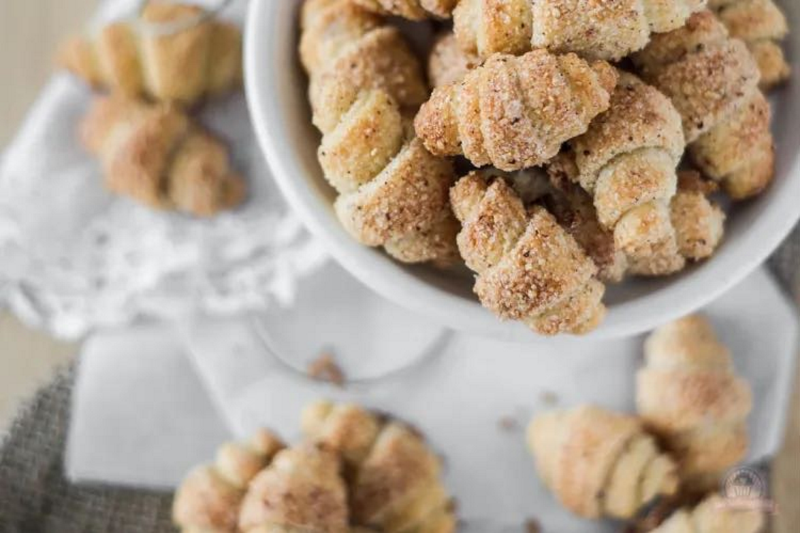

# Nusshörnchen

Portionen 64Stück

## Zutaten
- 300g Mehl
- 200g Butter
- 200g Doppelrahmfrischkäse (Philadelphia o.ä.)
- 60g Zucker
- 60g Brauner Zucker
- 60g gemahlene Haselnüsse
- 1TL Zimt
- Zitonenabrieb

## Zubereitung
- Aus Mehl, Butter und Frischkäse einen glatten Teig kneten. In Frischhaltefolie wickeln und mindestens zwei Stunden oder besser über Nacht in den Kühlschrank stellen.
- Beide Zuckersorten, gemahlene Haselnüsse, Zimt und Zitronenabrieb in einer Schüssel mischen.
- Backofen vorheizen Ober-/Unterhitze 175°C. Ein Backblech mit Backpapier auslegen.
- Teig aus dem Kühlschrank nehmen, vierteln und jeweils zu Kugeln formen.
- Etwas Haselnuss-Zuckermischung auf die Arbeitsplatte streuen und je eine Teigkugel darauf zu einer ca. 26 cm runden Platte ausrollen. Dabei auch wenden.
- Anschließend in 16 Teile schneiden (wie einen Kuchen) und zu Hörnchen aufrollen, auf ein mit Backpapier ausgelegtes Backblech setzen und im vorgeheizten Backofen ca. 12 Minuten backen.

