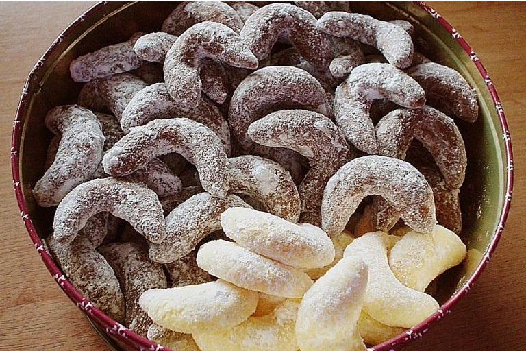

# Pudding Kipferl

## Zutaten 
- 220 g Mehl, glattes
- 120 g Butter, weiche
- 100 g Zucker
- 1 Pck. Puddingpulver (Vanille)
- 2 Eigelb
- 2 EL Milch
- Puderzucker
- 1 Pck. Vanillezucker

## Zubereitung

- Mehl mit den übrigen Zutaten der Reihe nach in eine Schüssel geben und mit dem Handmixer zu einem Teig verkneten, dann noch etwas mit den Händen verkneten. 
- Den Teig zu einer 2 cm dicken Rolle formen und in 1 cm dicke Stücke schneiden. 
- Teigstücke zu Rollen formen und dann zu Kipferln biegen und auf ein mit Backpapier ausgelegtes Backblech legen. 
- In die Mitte des vorgeheizten Rohres schieben.

Backtemperatur: 180 Grad  
Backzeit: ca. 12 Min  
Staubzucker mit Vanillezucker vermischen und die noch heißen Kipferln damit bestreuen.

