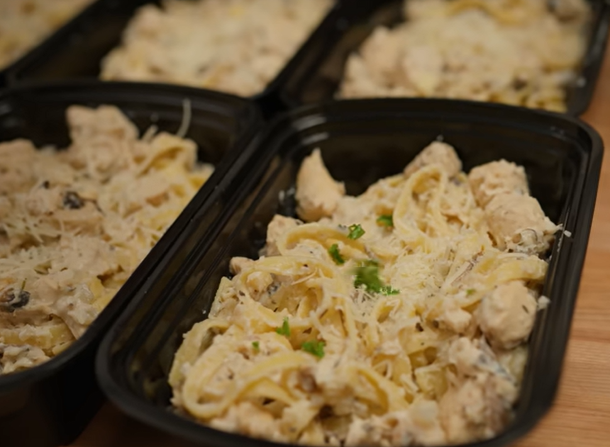

# Chicken Alfredo

Zubereitungszeit: 30 Minuten
6 Portionen
661 Kalorien, 75g Protein, 60g Kohlenhydrate, 11g Fett

## Zutaten
- 1 kg Hühnerbrust
- 1/2 mittelgroße Zwiebel
- 150 g Champignons (wahlweise)
- Italienisches Gewürz
- Gehackter Knoblauch
- Zitronensaft
- 50 g Parmesankäse
- 300 g Cottage cheese
- 200 g griechischer Joghurt
- 100ml Milch
- 150ml Hühnerbrühe
- Nudeln (Fettuccine empfohlen)

## Zubereitung
### Schritt 1
- Hühnchen in 1 cm große würfel schneiden.
- 2 Teelöffel Italienisches Gewürz dazu geben
- Salz und Pfeffer dazu geben
- 1 Teelöffel gehackter Knoblauchd dazu geben
- 1 Teelöffel Zitronensaft dazugeben
- Alles verrühren

### Schritt 2
- Zwiebel in Würfel Schneiden
- Champingnons schneiden
- Parmesan reiben

### Schritt 3
- Mit einem Mixer Cottage Cheese, Griechischer Joghurt, geriebenen Parmesan Milch zu einer cremigen Soße vermischen

### Schritt 4
- In einer Pfanne mit Olivenöl das Hühnchen-Kräuter-Gemisch anbraten
- Zeitgleich die Pasta kochen

### Schritt 5
- Wenn das Hühnchen fertig ist, 150 ml Hühnerbrühe, die schnittenen Champignons und die geschnittenen Zwiebel dazu geben

- Soße von dem Mixer und die Pasta dazu geben und gut verrühren.

### Schritt 6
- Auf 6 Portionen aufteilen für eventuelles Meal Prepping

## Quelle
https://www.youtube.com/watch?v=RHrBR6ccdMA