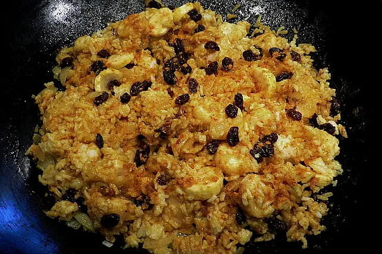

# Curry Bananen Reis

## Zutaten
- 250 g Reis, gekochter, kalter
- 5 Bananen, geschälte, in Stücke geschnittene
- 2 Zwiebeln, gewürfelte
- 2 EL Öl Rapsöl
- 100 g Butter
- 2 EL Currypulver (Madrascurry, hot)
- 2 EL Kurkuma
- Salz und Pfeffer
- 200 g Rosinen 

## Nährwerte pro Portion
| kcal  | Eiweiß |  Fett   | Kohlenhydr. |
| :---: | :----: | :-----: | :---------: |
|  843  | 9,65 g | 26,54 g |  137,25 g   |

## Zubereitung
Die Zwiebelwürfel in einer großen Pfanne in heißem Rapsöl anschwitzen. Die Bananen mit Currypulver und Kurkuma dazugeben und kurz weiter anschwitzen. Dann die Butter dazugeben und anschließend alle anderen Zutaten. Mit Salz und Pfeffer kräftig würzen. Etwas anbraten lassen, dann als Beilage auf Tellern anrichten und servieren. 

## Quelle
https://www.chefkoch.de/rezepte/1222861227617977/Curry-Bananen-Reis.html