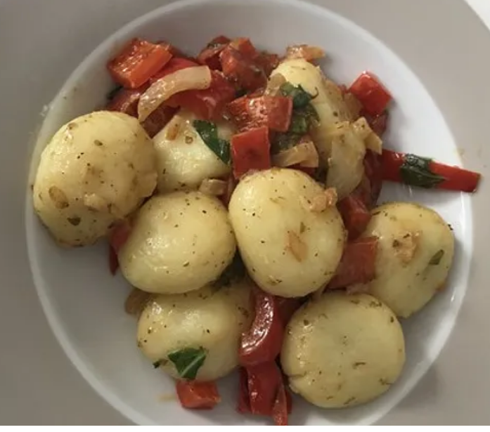

# Knödel mit Paprika-Zwiebel Souce

Zubreitungszeit: 30 Minuten

## Zutaten
- [Semmelknödelrezept](Semmelknödel.md){:target="_blank"}
- 2 Paprikaschote(n)
- 2 Zwiebel(n)
- 200 ml Sahne
- 200 ml Öl
- n. B. Basilikum
- n. B. Salz und Pfeffer
- n. B. Oregano 

## Zubereitung
- Paprikaschote und Zwiebel putzen und kleinschneiden. 
- In einer Pfanne mit etwas Öl anbraten. 
- Danach Sahne und erneut Öl dazugeben und weiter köcheln lassen. 
- Wenn das alles sämig geworden ist, Basilikum zufügen und je nach Geschmack würzen (Pfeffer, Salz und Oregano).

## Quelle
https://www.chefkoch.de/rezepte/3591051539943921/Knoedel-mit-Paprika-Zwiebel-Sosse.html?portionen=4