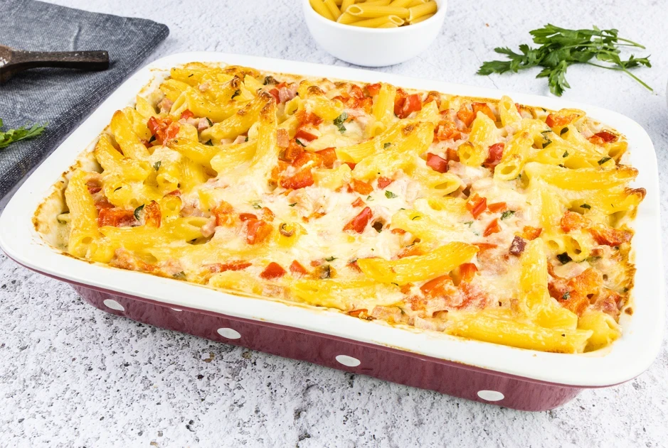

# Nudelauflauf mit Schinken

Zubereitungszeit: 35 Minuten

## Zutaten
- 200 g Nudeln
- 1 Stk Zwiebel
- 3 Stk Paprika
- 250 g Schinken
- 250 g Käse (gerieben)
- 200 ml Schlagobers
- 1 Prise Salz
- 1 Prise Pfeffer
- 1 Pk Petersilie (TK oder frisch)
- 1 EL Öl für die Form

## Zubereitung
### Schritt 1
Für den Nudelauflauf mit Schinken zuerst das Backrohr auf 180 Grad Ober-/Unterhitze vorheizen. Die Nudeln in einem Topf mit Salzwasser kochen, anschließend in einem Sieb gut abtropfen lassen.

### Schritt 2
Zwiebel schälen und fein hacken, Paprika waschen, Kerne entfernen und in mundgerechte Stücke schneiden. Schinken klein würfeln.

### Schritt 3
Nun Käse, Obers, Salz, Pfeffer und Petersilie in einer Schale gut vermengen und kräftig abschmecken. Die Auflaufform mit etwas Öl einstreichen. Nun die Nudeln mit dem Schinken, Gemüse und Käse-Oberssauce in der Auflaufform gut vermengen.

### Schritt 4
Im Backrohr etwa 20 Minuten überbacken, bis die Oberfläche goldbraun ist.

## Quelle
https://www.gutekueche.at/nudelauflauf-mit-schinken-rezept-22672