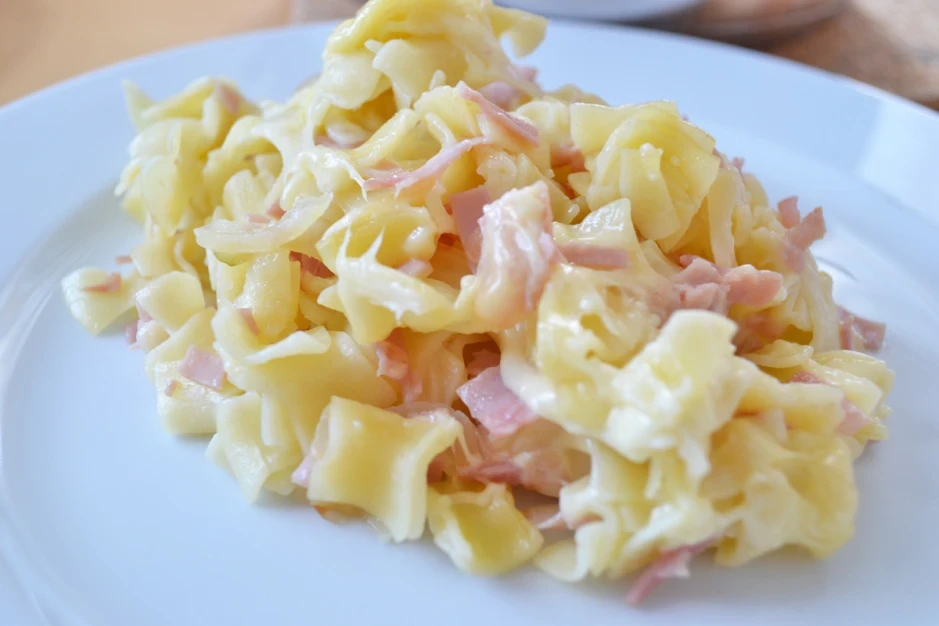

# Schinkenfleckerl

Zubereitungszeit: 20 Min.

## Zutaten
- 400 g Fleckerl
- 1 Stk Zwiebel
- 1 Stk Knoblauchzehe
- 1 Schuss Öl
- 120 g Schinken
- 1 Prise Salz
- 1 Prise Pfeffer
- 1 Prise Majoran
- 100 g Käse (beliebig)

### Zusätzliche Zutaten für die überbackene Variante
- 1 Prise Salz
- 1 Stk Ei
- 200 ml Schlagobers

## Zubereitung

### Schritt 1
Für die Schinkenfleckerl in einem großen Topf Salzwasser zum Kochen bringen, die Fleckerl zufügen und al dente (bissfest) kochen, danach abseihen und mit kalten Wasser abschrecken - (es können auch andere Teigwaren, wie Spiralen oder Penne verwendet werden).

### Schritt 2
Anschließend Öl in einem weiteren Topf heiß werden lassen, in feine Würfel geschnittene Zwiebel- und Knoblauchstücke darin hellbraun rösten.

### Schritt 3
Den Schinken in kleine Stücke schneiden und 1-2 Minuten mitrösten. Danach die Fleckerl untermischen und mit Salz, Pfeffer und Majoran würzen.

### Schritt 4
Die Fleckerl mit geriebenen Käse bestreuen und mit grünem Salat mit Kernöl servieren.

### Tipps zum Rezept

Die überbackene Schinkenfleckerl- Variante: Ei mit Schlagobers und Salz verrühren und über die Fleckerl gießen, umrühren. Mit geriebenem Parmesan bestreuen und bei 180°C ca. 12 Min. in den Backofen geben.

Falls man keine Fleckerl zur Hand hat, kann man auch Bandnudeln nehmen und diese in kleinere Stücke brechen.

Schinkenfleckerl lassen sich auch sehr gut vorbereiten bzw. können zu viel gekochte Fleckerl vom Vortag verwendet werden.

Auch übrig gebliebener Schinken jeder Art, kann hervorragend für Schinkenfleckerl verarbeitet werden.

## Quelle
https://www.gutekueche.at/schinkenfleckerl-rezept-4907