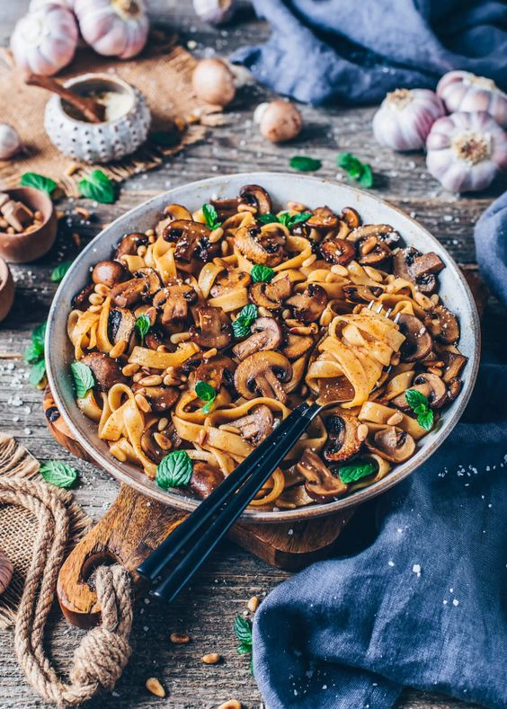

# Schnelle Nudel-Pilz-Pfanne

- Allergenen:
    - Weizen

- Gesamtzeit: 15 Minuten
- Arbeitszeit: 10 Minuten
- Schwierigkeitsgrad: Einfach

## Nährwertangaben pro Portion
- Vitamin A: 360IU
- Vitamin C: 7mg 
- Kalorien: 556kcal 
- Kohlenhydrate: 76g 
- Eiweiß: 18g 
- Fett: 18g 
- Gesättigte Fettsäuren: 2g 
- Natrium: 687mg 
- Kalium: 743mg 
- Ballaststoffe: 5g 
- Zucker: 9g 
- Kalzium: 37mg 
- Eisen: 3mg

## Zutaten
Portionsgröße 3 Personen

- 250 g Nudeln 
    - z.B. Tagliatelle, Fettuccine, Spaghetti 
- 2 EL Öl 
    - zum Braten 
    - z.B. Raps-, Sonnenblumen-, Oliven- oder Kokosöl 
- 1 Zwiebel fein gewürfelt 
- 2 Knoblauchzehen gehackt 
- 350 g Champignons in Scheiben geschnitten 
- 1 EL Balsamico-Essig 
- 2 EL Sojasauce oder Tamarisauce 
- 1 TL Thymian-Blätter frisch oder getrocknet 
- 1 TL Paprikapulver oder Chilipulver nach Geschmack 
- 120 ml veganer Weißwein optional
- 1 TL Ahornsirup oder anderer Sirup/Zucker 
- Salz Pfeffer (nach Geschmack) 

### Zum Garnieren (optional) 
- 3-4 EL Pinienkerne 
- 2-3 EL Veganer Parmesan oder Hefeflocken 
- frische Kräuter nach Belieben

## Kochutensilien
- Großer Topf
- Große Pfanne
- Sieb

## Zubereitung
### Schritt 1
- Einen großen Topf mit gesalzenem Wasser zum Kochen bringen. Die Nudeln hineingeben und gemäß der Packungsanleitung bissfest kochen. Anschließend die Nudeln in einem Sieb abgießen und dabei etwa 150 ml des Nudelwassers auffangen.

### Schritt 2
- Währenddessen das Öl in einer großen Antihaft- oder Gußeisen-Pfanne auf mittlerer bis hoher Stufe erhitzen. Die Champignons hinzufügen und ca. 2-3 Minuten (ohne Rühren) scharf anbraten, bis sie auf einer Seite goldbraun sind. Dann umdrehen, die Hitze etwas reduzieren und weitere 2 Minuten braten.

### Schritt 3
- Nun die Zwiebeln hinzufügen und weitere 2 Minuten braten, dann den Knoblauch hinzufügen und eine weitere Minute mitdünsten, dabei gelegentlich umrühren. 

### Schritt 4
- Balsamico-Essig, Sojasauce, Thymian, Paprika- oder Chilipulver hinzufügen und umrühren, bis die Champignons gleichmäßig mit der Marinade bedeckt sind. Dann mit Weißwein ablöschen, Ahornsirup hinzufügen und 1-2 Minuten köcheln lassen, bis die Flüssigkeit fast verdampft ist. 

### Schritt 5
- Zum Schluss die gekochten Nudeln und etwas von dem aufgefangenen Nudelwasser in die Pfanne geben und alles gut vermengen. Nach Geschmack mit Salz und Pfeffer oder anderen Gewürzen nach Belieben würzen. 

### Schritt 6
- Währenddessen Pinienkerne in einer kleinen Pfanne ohne Zugabe von Öl goldbraun rösten. 

### Schritt 7
- Die Pilznudeln in Schüsseln oder auf Tellern servieren und nach Wunsch mit veganem Parmesan, gerösteten Pinienkernen und frischen Kräutern garnieren. 

- Guten Appetit!

Quelle: https://biancazapatka.com/de/pasta-mit-pilzen/#recipe .