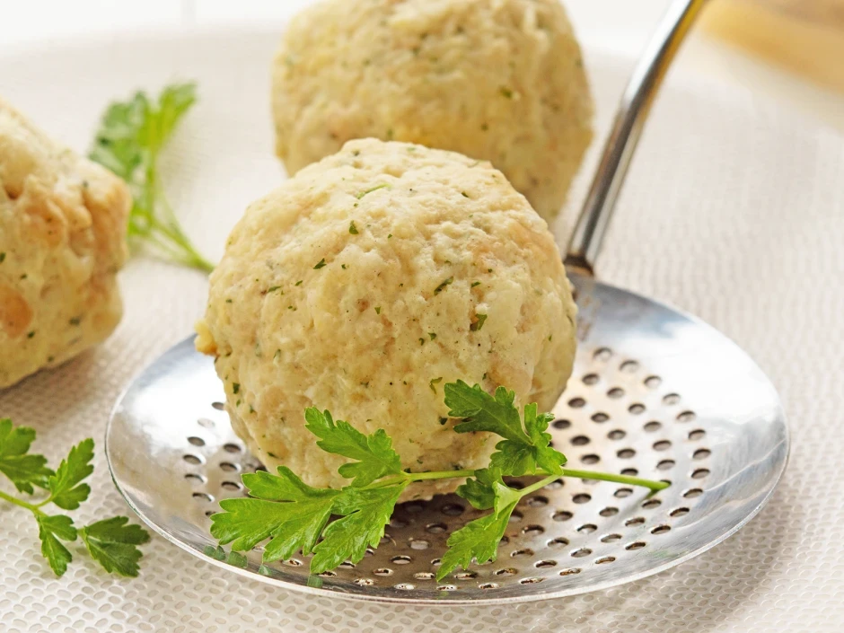

# Semmelknödel

## Zutaten
- 0.5 kg Weißbrot oder Semmeln (2 - 3 Tage alt)
- 0.5 l Milch
- 1 Prise Salz
- 1 Prise Pfeffer
- 1 Prise Muskat
- 1 Bund Petersilie (fein gehackt)
- 2 Stk Eier (versprudeln)
- 1 Stk Zwiebel
- 1 TL Butter (für die Pfanne)
- 3 EL Mehl (zum Formen der Knödel)

## Zubereitung

### Schritt 1
Für köstliche Semmelknödel zuerst die Semmeln in sehr dünne Scheiben (5-10 mm) oder kleine Würfel schneiden - natürlich kann man auch fertige Semmelwürfel (ca. 300 Gramm) verwenden. Die Milch erwärmen, über die Semmelstücke gießen und für ein paar Minuten ziehen lassen.

### Schritt 2
Anschließend Salz, Pfeffer, Muskat, die feingehackte Petersilie und die vorher versprudelten Eier gut mit der eingeweichten Semmelmasse unterkneten – am besten mit feuchten Händen.

### Schritt 3
Die Zwiebel schälen, fein reiben oder schneiden und in einer Pfanne mit etwas Butter leicht andünsten (nicht braun werden lassen). Diese ebenfalls unter die Knödelmasse geben und alles gut durchkneten.

### Schritt 4
Nun mit feuchten Händen (oder mit Hilfe eines Eisportionierers) beliebig große Knödel formen: Dabei den Teig gut zusammendrücken und Kugeln formen, anschließend in Mehl wenden.

### Schritt 5
Die Semmelknödeln in einem großen Topf mit leicht kochendem Salzwasser 15 - 20 min. (je nach Größe) ziehen lassen, bis sie nach oben steigen. Danach die Semmelknödel mit einem Schaumlöffel aus dem Wasser nehmen.

## Quelle
https://www.gutekueche.at/klassischer-semmelknoedel-rezept-876