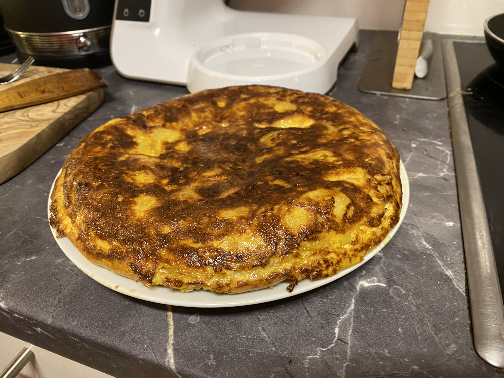

# Spanische Omlettes

## Beschreibung

Spanische Omlettes basierend auf Tonys Kochkünsten.

## Zutaten für 4 Personen

- 300g Zwiebel
- 700g Erdäpfel
- 6 Eier
- Olivenöl
- Salz

## Zubereitung

### Schritt 1

Zwiebel quer in Scheiben schneiden. Bei sehr geringer Hitze ohne Öl in einer Pfanne für 30 Minuten braten. Mindestens alle 10 Minuten umrühren.

### Schritt 2

Kartoffeln schälen und in 3-5 mm Scheiben schneiden. Für 15 Minuten in Wasser einlegen.

### Schritt 3

Kartoffeln in eine Pfanne legen und mit Öl bedecken, bis alle Kartoffeln unter Öl sind. Kartoffeln bei mittlerer Hitze kochen bis sie weich werden. Sobald sie weich sind können sie optional bei höherer Hitze gebraten werden.

### Schritt 4

Eier in eine Schüssel schlagen und verrühren. Alle Zutaten hinzufügen. Gemisch 3 - 5 Minuten in einer Pfanne braten, bis das Omlet nicht mehr bricht wenn man es wendet. Dann einmal wenden und nochmal 3 - 5 Minuten braten.

!!! warning "Sauerei"
    Das kann eine ziemliche Sauerei werden. Tonys Tipp: Pfanne mit einem Teller oder anderen Pfanne abdecken, dann wenden.
