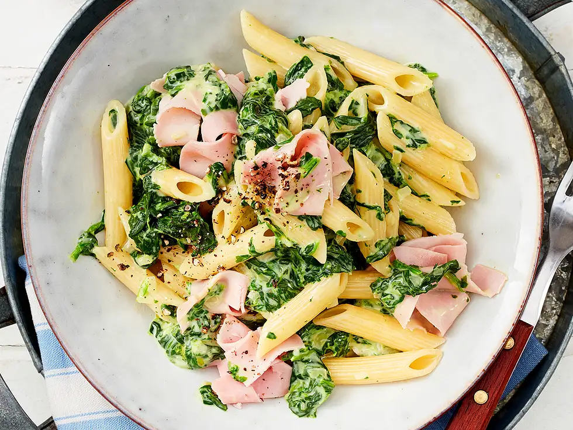

# Spinatnudeln mit Schinken

Zubereitungszeit: 20 Min.

## Zutaten
- 300 g Nudeln (z.B. Penne Rigate)
- Salz
- 2 Zwiebeln
- 2 EL Öl
- 1 Pck. TK-Rahmspinat
- 200 g Schmelzkäse
- Pfeffer
- 150 g Kochschinken 

## Zubereitung
### Schritt 1
Nudeln in kochendem Salzwasser nach Packungsanweisung zubereiten. Zwiebeln schälen und fein würfeln. Öl in einem Topf erhitzen und Zwiebeln darin glasig dünsten. Rahm-Spinat zufügen auftauen und kurz aufkochen. Schmelzkäse zugeben und einrühren. Mit Salz und Pfeffer abschmecken.

### Schritt 2
Schinken in Streifen schneiden. Nudeln abgießen, dabei ca. 100 ml Flüssigkeit auffangen. Nudeln und Hälfte Schinken zum Spinat in den Topf geben und miteinander vermengen. In Schüsseln anrichten, mit Rest Schinken garnieren und mit etwas grobem Pfeffer bestreuen.

## Quelle
https://www.chefkoch.de/rs/s0/schnelles+mittagessen+warm/Rezepte.html