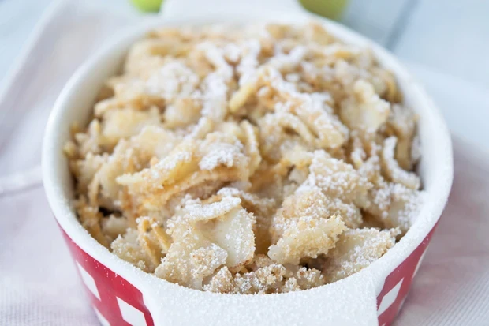

# Apfelfleckerl

Zubereitungszeit: 25 Minuten

## Zutaten
- 500 g Äpfel
- 2 Prise Zimt (gemahlen)
- 2 EL Butter
- 110 g Semmelbrösel
- 350 g Fleckerln

## Zubereitung
### Schritt 1
Zuerst werden die Fleckerl in kochendem Salzwasser laut Packungsanleitung bissfest gekocht, dann werden sie abgeseiht und mit kaltem Wasser abgeschreckt.

### Schritt 2
Nun werden die Äpfel gewaschen, fein geraspelt sowie mit dem Zimt vermischt. Die Butter wird zerlassen und die Bröseln werden darin für etwa 5 Minuten leicht angeröstet.

### Schritt 3
Im Anschluss werden Fleckerl, Äpfel und Brösel vermengt und in eine eingefettete Auflaufform gefüllt. Die Form kommt für 5-10 Minuten in den auf 180°C vorgeheizten Backofen.

## Quelle
https://www.gutekueche.at/apfelfleckerln-rezept-22774